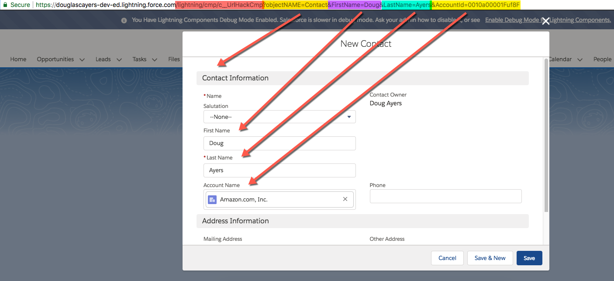
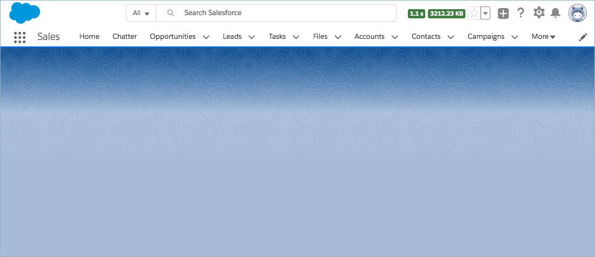

Legitimate "URL Hacking" in Lightning Experience
================================================

Inspired by [Brian Kwong](https://twitter.com/Kwongerific)'s [blog post](https://thewizardnews.com/2018/08/02/url-hack-functionality-lightning/)
on "URL Hacking" with supported features in Lightning Experience. 

This project's purpose is to determine a way to provide the "URL Hacking" in Lightning Experience
with supported features in Lightning Experience but without the need of a Flow so that we can have
a reusable solution for any object and supporting arbitrary number of fields and data types.
This is actually one of the wish items Brian talks about at the end of his blog post.

Creating Custom Button URL
--------------------------

The start of the URL should be `/lightning/cmp/c__URL_CreateRecordCmp?`, this tells Lightning Experience which component to navigate to.
The below table describes the supported parameters to append to the URL. Separate each `parameter=value` pair with `&`.

| Name | Description | Required? |
|------|-------------|-----------|
| `objectName` | API name of the object whose create form to show. | Yes |
| `recordTypeId` | ID of the record type of the new record. | No |
| `recordId` | ID of the current record where user is clicking the button from. Workaround for no cancel behavior customization. | No |
| field name | One or more API field names whose default values to populate (e.g. FirstName, Phone, Active__c) | No |

Examples
--------

Account button that opens the new contact form, pre-populating the first and last name fields:
* `/lightning/cmp/c__URL_CreateRecordCmp?recordId={!Account.Id}&objectName=Contact&FirstName=Doug&LastName=Ayers`

Design
------

In [Summer '18](https://releasenotes.docs.salesforce.com/en-us/summer18/release-notes/rn_lc_components_navigation.htm),
a new interface was introduced, [lightning:isUrlAddressable](https://developer.salesforce.com/docs/component-library/bundle/lightning:isUrlAddressable/documentation),
which allows us to create URLs and pass arbitrary parameters to Lightning Components. Great! So that part is done, no
need for Flow, we can create URL buttons similar to how we did in Classic so many moons ago.

However, by navigating to this lightning component as a URL, you are navigating away from the original
record page you were on when you clicked the button. The problem with that is there is no way to control
what happens when the user clicks the **cancel** or **save** buttons in the modal dialog.

When the user clicks the **save** button, then they are taken to view the new record.
This default behavior is acceptable, for now.

When the user clicks the **cancel** button, though, the modal simply disappears.
The user is not redirected back to where they had clicked the button, so they are left with a blank page.
This default behavior is not acceptable.

To compensate for the lack of control of the cancel behavior, the component supports a `recordId` URL parameter.
When specified in the URL, the record is loaded in the background when the create record modal appears. By the time the user clicks the
cancel button, the original record will have been loaded and the user won't notice that they had navigated away to begin with.

Next Steps
----------

Please vote for the `force:recordCreate` event to expose callbacks to customize the modal dialog button behavior:
* [Callback method for force:createRecord event to redirect or refresh after save](https://success.salesforce.com/ideaView?id=0873A0000003V4hQAE)
* [Allow redirect after creating a new record using force:createRecord](https://success.salesforce.com/ideaView?id=0873A0000003VnmQAE)
